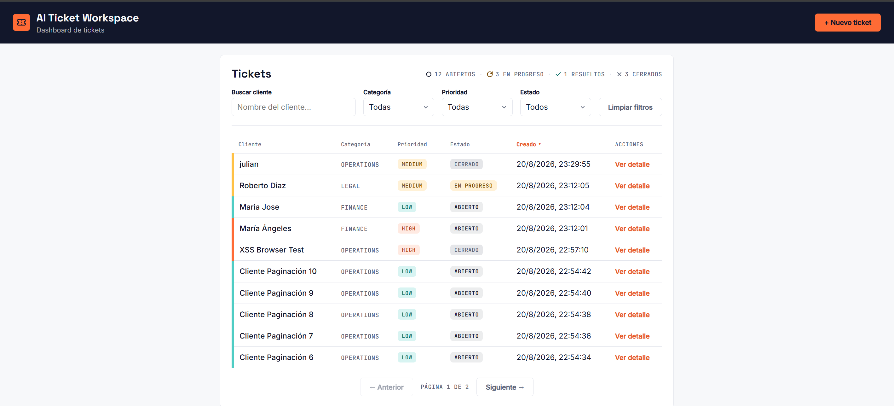
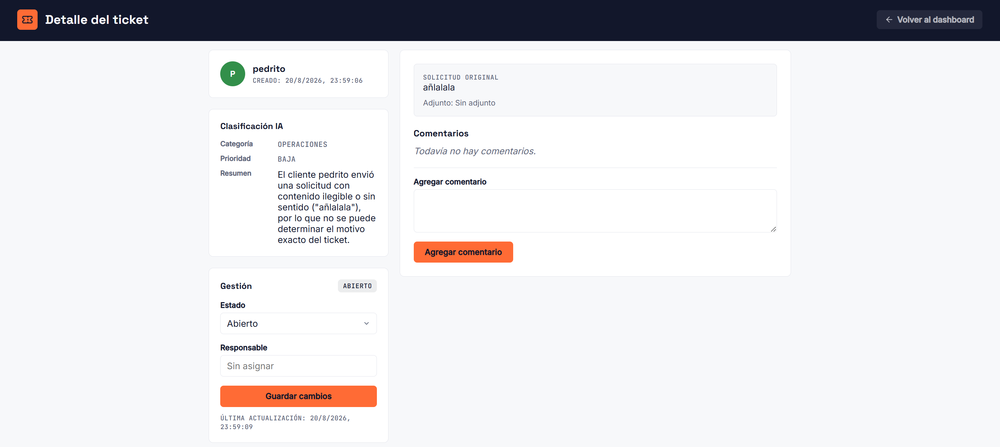
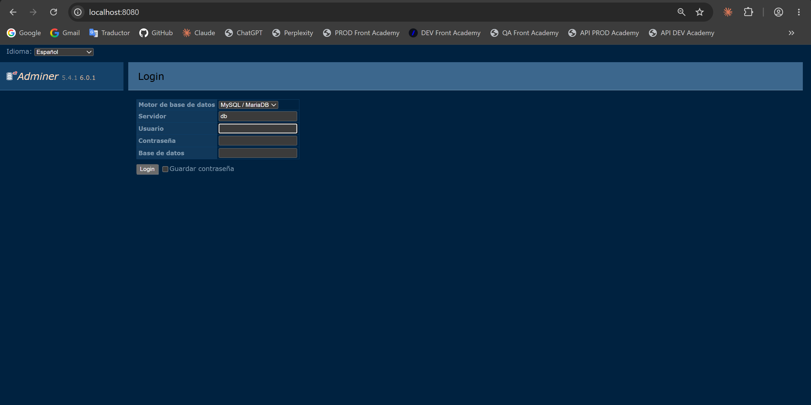

# Prueba técnica Sysdatec - Desarrollador de Software AI First
### Julian Andres Montoya Carvajal

## 1. Descripción del proyecto

AI Ticket Workspace es una aplicación web para la recepción, clasificación automática y seguimiento de tickets operacionales (finanzas, legal, compras y operaciones). Los tickets se crean desde un dashboard, se clasifican automáticamente usando IA (categoría, prioridad y resumen) y se gestionan mediante un flujo de estados con comentarios de seguimiento. Este proyecto fue desarrollado como prueba técnica para Sysdatec Corp.

## 2. Stack tecnológico

- **Backend:** FastAPI, SQLModel, PostgreSQL, Anthropic SDK (Claude)
- **Frontend:** HTML/CSS/JS vanilla (sin frameworks)
- **Infraestructura:** Docker, Docker Compose, Adminer
- **Otras herramientas usadas en el desarrollo:** Playwright (pruebas E2E del frontend en navegador real durante el desarrollo, no forma parte del stack de producción)

## 3. Arquitectura del backend (3 capas)

El backend sigue una arquitectura de 3 capas con responsabilidades separadas:

- **`routers/`** → define los endpoints HTTP, valida la entrada vía schemas de Pydantic/SQLModel, y delega toda la lógica al service correspondiente. No contiene lógica de negocio.
- **`services/`** → orquesta la lógica de negocio. Por ejemplo, `ticket_service.py` coordina la creación del ticket con la llamada al clasificador de IA (`ai_classifier_service.py`), y decide qué hacer si la clasificación falla.
- **`crud/`** → capa de acceso a datos. Contiene únicamente queries a PostgreSQL vía SQLModel (crear, leer, actualizar), sin ninguna lógica de negocio.

```
Cliente (frontend)
      │  fetch() → JSON
      ▼
Router (FastAPI)
      │  valida el payload (schemas)
      ▼
Service (lógica de negocio + IA)
      │  orquesta crud + ai_classifier_service
      ▼
CRUD (SQLModel)
      │  queries
      ▼
PostgreSQL
```

## 4. Flujo de datos completo (creación y clasificación de un ticket)

1. El frontend envía `POST /tickets` con `customer_name`, `request_text` y `attachment_url` opcional.
2. El router (`routers/ticket.py`) valida el payload contra el schema `TicketCreate` (incluyendo `min_length=1` con `.strip()` para rechazar nombres/textos vacíos o solo espacios) y lo pasa a `ticket_service.create_ticket`.
3. El service persiste el ticket inicial vía `crud/ticket.py`, con `status="open"` y `category`/`priority`/`ai_summary` en `null`.
4. El service llama a `ai_classifier_service.classify_ticket`, que usa el SDK de Anthropic con **tool-use forzado** (function calling con JSON Schema y `tool_choice={"type": "tool", "name": "classify_ticket"}`) para garantizar que `category`/`priority` vengan siempre dentro de los valores permitidos (`Finance`/`Legal`/`Procurement`/`Operations` y `High`/`Medium`/`Low`), evitando que el modelo se desvíe del formato esperado incluso ante manipulación del texto del ticket (prompt injection).
5. `attachment_url`, si viene, se incluye como referencia textual dentro del prompt enviado al modelo (por ejemplo `Attachment URL: https://...`). No se descarga ni se lee el contenido del adjunto — el modelo solo ve la URL como dato de contexto adicional.
6. Si la clasificación falla por cualquier motivo (`ANTHROPIC_API_KEY` inválida o no configurada, timeout, error del proveedor, respuesta sin `tool_use`, o valores fuera del enum), el ticket se guarda igual con `category`/`priority`/`ai_summary` en `null`, se registra un log de warning, y el endpoint responde `201` normalmente — nunca se tumba la creación del ticket por un fallo de IA.
7. El resultado final (clasificado o no) se persiste vía `crud/ticket.set_ai_classification` y se devuelve al frontend en la respuesta del `POST /tickets`.

## 5. Uso de IA en el desarrollo del proyecto

- Se usó **Claude Code** como asistente principal de desarrollo, guiado por fases incrementales (estructura base y Docker, modelo de datos y CRUD, integración de IA, frontend, pulido visual) en vez de generación de todo el proyecto de una sola vez, para mantener control sobre las decisiones de arquitectura en cada paso.
- Se usaron las skills de diseño frontend disponibles en el entorno de Claude Code para guiar la dirección visual del dashboard (paleta de color, tipografía, sistema de badges y componentes), evitando un resultado genérico de "plantilla".
- Se tomaron como referencia patrones de proyectos propios anteriores (uso del SDK de Anthropic, estructura de llamadas al API) para la integración del clasificador de IA.
- Se hicieron **pruebas adversariales deliberadas** antes de la entrega: prompt injection directo, falsa autoridad de sistema ("SYSTEM OVERRIDE"), intentos de romper el schema de clasificación con valores fuera del enum, y casos límite (texto vacío, solo espacios, un carácter, texto de ~5000 palabras, HTML/`<script>` embebido, idiomas no previstos). En todos los casos el `tool_choice` forzado con JSON Schema mantuvo la salida dentro de los valores permitidos, y el frontend confirmó no ejecutar ningún payload XSS (siempre `textContent`, nunca `innerHTML` con datos del backend).

## 6. Uso de IA en el producto (clasificación de tickets)

- **Modelo usado:** Claude (Anthropic), vía tool-use forzado (function calling) en vez de parseo de texto libre, para garantizar que la salida siempre cumpla el schema esperado.
- **Qué hace:** genera `category`, `priority` y un `summary` (resumen de 1-2 líneas, siempre en español independientemente del idioma del `request_text` original) a partir de `customer_name`, `request_text` y `attachment_url`.
- **Manejo de fallos:** controlado (degradación elegante) — si la IA no está disponible o falla, el ticket se crea igual sin clasificar, sin bloquear al usuario ni devolver un error al endpoint.

## 7. Decisiones de diseño relevantes

- `attachment_url` se trata como referencia textual (URL), no como upload de archivo, dado el alcance del challenge; se pasa como dato de contexto adicional al prompt del clasificador, sin descargar ni leer su contenido.
- Los comentarios se implementan como un log append-only (solo creación), siguiendo el patrón estándar de sistemas de tickets.
- El campo `owner` es texto libre sin sistema de autenticación, ya que el alcance del challenge no especifica gestión de usuarios.
- `category`, `priority` y `status` se mantienen en inglés como valores internos del sistema (alineado con el enunciado original de la prueba), mientras que el frontend traduce estos valores al español únicamente en la capa de presentación (tabla, filtros, detalle), sin afectar el contrato de datos con el backend.
- Paginación, filtros y ordenamiento del dashboard se implementan en el frontend (client-side) sobre los tickets ya cargados desde `GET /tickets`, una decisión razonable dado el volumen de datos esperado en el alcance de esta prueba; en un sistema con mayor volumen se movería a paginación server-side.

## 8. Setup e instrucciones de ejecución

### Prerequisitos

- Docker
- Docker Compose (v2, integrado en Docker Desktop o como plugin `docker compose`)
- Una API key válida de Anthropic con saldo disponible ([console.anthropic.com](https://console.anthropic.com))

### Pasos

1. Clonar el repositorio:

   ```bash
   git clone <url-del-repo>
   cd sysdatec-ai-ticket-workspace
   ```

2. Copiar el archivo de variables de entorno de ejemplo:

   ```bash
   cp .env.example .env
   ```

3. Completar `.env` con tus valores. Variables disponibles:

   | Variable             | Descripción                                                                 | Valor por defecto        |
   |----------------------|-------------------------------------------------------------------------------|---------------------------|
   | `POSTGRES_USER`      | Usuario de la base de datos PostgreSQL                                       | `postgres`                |
   | `POSTGRES_PASSWORD`  | Password de la base de datos PostgreSQL                                      | `changeme` (cámbialo)     |
   | `POSTGRES_DB`        | Nombre de la base de datos                                                    | `ai_ticket_workspace`     |
   | `POSTGRES_PORT`      | Puerto donde se expone Postgres en el host                                    | `5432`                    |
   | `BACKEND_PORT`       | Puerto donde se expone la API de FastAPI en el host                           | `8000`                    |
   | `ANTHROPIC_API_KEY`  | **Requerida** para que la clasificación con IA funcione. Sin ella, los tickets se crean igual pero sin `category`/`priority`/`ai_summary`. | *(vacío)* |
   | `FRONTEND_PORT`      | Puerto donde se expone el frontend (nginx) en el host                         | `80`                      |
   | `ADMINER_PORT`       | Puerto donde se expone Adminer en el host                                     | `8080`                    |

4. Levantar todos los servicios:

   ```bash
   docker compose up --build
   ```

   Esto levanta 4 contenedores: `postgres`, `backend`, `frontend` y `adminer`. Las tablas se crean automáticamente al arrancar el backend (no se requiere ejecutar migraciones).

### Troubleshooting

Preferiblemente trabajar en Ubuntu 22.04 LTS (puede utilizar WSL2 en Windows para instalar Ubuntu).

Tener instalado Docker y Docker Compose para la orquestación de los servicios: https://www.digitalocean.com/community/tutorials/how-to-install-and-use-docker-on-ubuntu-22-04

**Puertos ocupados:** si `docker compose up` falla con un error de tipo `address already in use` en el puerto 5432 (PostgreSQL) o 8000/8080 (app/Nginx), significa que otro proceso ya está usando ese puerto en el host. Es común que ocurra con un PostgreSQL instalado nativamente en el sistema. En Ubuntu, se libera con:

```bash
sudo systemctl stop postgresql
sudo systemctl disable postgresql
```

**Comandos de limpieza**

Si algo falla o se quiere reiniciar todo desde cero:

```bash
sudo docker compose down
```

Detiene y elimina los contenedores (mantiene los volúmenes, es decir, los datos de la base de datos).

```bash
sudo docker compose down -v
```

Igual al anterior, pero además borra los volúmenes (se pierden los datos de la base de datos).

```bash
sudo docker compose down --rmi all
```

Borra también las imágenes construidas por el proyecto.

```bash
sudo docker builder prune -a -f
```

Limpia la caché de build de Docker.

## 9. Enlaces disponibles

Con los servicios levantados (usando los puertos por defecto):

- **Frontend:** [http://localhost](http://localhost)
- **Backend docs (Swagger/OpenAPI):** [http://localhost:8000/docs](http://localhost:8000/docs)
- **Adminer:** [http://localhost:8080](http://localhost:8080)

  Credenciales de conexión (usa los valores que hayas puesto en tu propio `.env`; estos son los valores por defecto de `.env.example`):

  | Campo | Valor |
  |---|---|
  | Sistema | `PostgreSQL` |
  | Servidor | `postgres` (nombre del servicio en `docker-compose.yml`, no `localhost`) |
  | Usuario | el valor de `POSTGRES_USER` en tu `.env` (por defecto `postgres`) |
  | Contraseña | el valor de `POSTGRES_PASSWORD` en tu `.env` |
  | Base de datos | el valor de `POSTGRES_DB` en tu `.env` (por defecto `ai_ticket_workspace`) |

## 10. Capturas de pantalla

**Dashboard** — listado de tickets con resumen de estados, filtros, ordenamiento por columnas y paginación:



**Creación de ticket** — modal de creación accesible desde "+ Nuevo ticket":


**Detalle del ticket** — clasificación IA (categoría, prioridad, resumen), gestión de estado/responsable e hilo de comentarios:



**Documentación de la API (Swagger / OpenAPI)** — generada automáticamente por FastAPI en `/docs`:


**Administrador de base de datos (Adminer)** — acceso a PostgreSQL en `http://localhost:8080`:



## 11. Checklist de requisitos funcionales

| Requisito | Cómo está cubierto |
|---|---|
| Levantar el proyecto con `docker compose up --build` | `docker-compose.yml` orquesta 4 servicios (`postgres`, `backend`, `frontend`, `adminer`); las tablas se crean automáticamente al arrancar el backend vía `SQLModel.metadata.create_all` en el `lifespan` de FastAPI, sin migraciones manuales. |
| Crear un ticket nuevo desde la UI | Modal "+ Nuevo ticket" en el dashboard (`index.html`), con campos `customer_name`, `request_text` y `attachment_url` opcional → `POST /tickets`. |
| Disparar la clasificación de IA con una API key válida | Al crear el ticket, `ticket_service.create_ticket` llama automáticamente a `ai_classifier_service.classify_ticket` (Claude, tool-use forzado); `category`, `priority` y `ai_summary` quedan visibles en la card "Clasificación IA" de la vista de detalle. |
| Ver el ticket guardado en la base de datos | Vía Adminer (`http://localhost:8080`), inspeccionando las tablas `tickets`/`comments`; o vía `GET /tickets` y `GET /tickets/{id}` en la documentación Swagger (`/docs`). |
| Actualizar status, owner y comentarios del ticket | Vista de detalle (`ticket.html`): selector de Estado + input de Responsable + botón "Guardar cambios" (`PATCH /tickets/{id}`); formulario "Agregar comentario" en el hilo (`POST /tickets/{id}/comments`). |
| Explicar la arquitectura principal y el flujo de datos | Secciones [3. Arquitectura del backend](#3-arquitectura-del-backend-3-capas) y [4. Flujo de datos completo](#4-flujo-de-datos-completo-creación-y-clasificación-de-un-ticket) de este README. |
| Revisar el README y el proceso de setup | Sección [8. Setup e instrucciones de ejecución](#8-setup-e-instrucciones-de-ejecución), con prerequisitos, tabla de variables de entorno, comando único de arranque y troubleshooting. |
